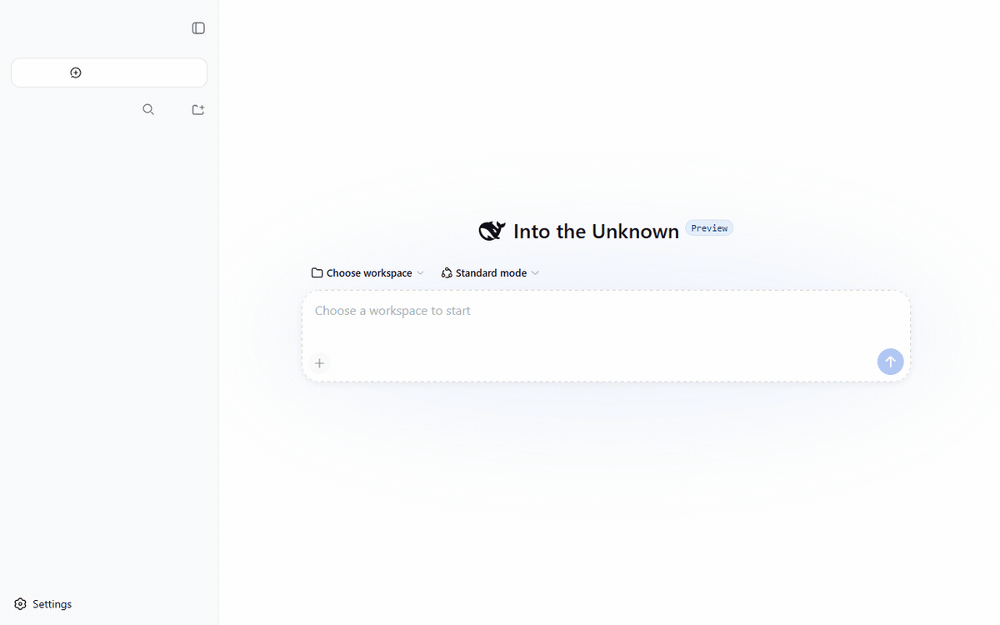

<!-- enlaces de idioma -->
[English](README.md) · [中文](README.zh.md) · [Español](README.es.md) · [Português](README.pt.md) · [हिन्दी](README.hi.md)

<div align="center">

# 🤖 dsh-auto-review

**Aprobación automática por segundo modelo para DeepSeek Harness** — el patrón `approvals_reviewer=auto_review` de Codex / *auto mode* de Claude Code, implementado como un plugin puro de Cordis.

Cuando una acción del agente cruza el límite del sandbox, un **subagente revisor de solo lectura** decide allow/deny — con un motivo — para que los humanos no aprueben nada mientras nada inseguro se cuela.

[](LICENSE)
[](https://www.npmjs.com/package/@deepseek-ai/dsh)
[](https://www.npmjs.com/package/dsh-auto-review)
[](https://www.npmjs.com/package/dsh-auto-review)
[](.github/workflows/ci.yml)
[](src)
[](cordis.patch.yml)
[](https://github.com/PerryLink/dsh-auto-review)

**Cero operaciones humanas.** La petición va al revisor de IA, el veredicto es allow/deny + motivo + nivel de riesgo, y cada decisión se puede reconstruir desde el registro de sesión: `approval/asked` → `autoReview/verdict` (o `autoReview/rejection` para desactivaciones duras) → `approval/decided`.



*Una ejecución real de evidencia (servidor real, clave de API real, dos rondas de modelo reales): el revisor de IA **permite** una escritura con escalado dentro del workspace (riesgo bajo, 5,2 s) y luego **deniega** un borrado recursivo fuera del workspace (riesgo alto, 8,9 s) — el motivo de la denegación se devuelve al modelo, visible en la transcripción.*

</div>

## ¿Por qué un segundo modelo en lugar de reglas?

Los auto-aprobadores basados en patrones deciden antes del despacho, sin evidencia. `dsh-auto-review` entrega la decisión a un **subagente revisor** que lee el workspace real (con su cara de herramientas de solo lectura), los argumentos de la llamada ya presentados (valores sensibles redactados), el motivo de la petición y tus reglas de riesgo — y devuelve un veredicto estructurado. Un veredicto de denegación devuelve su **motivo al modelo que llama**, para que el agente aprenda el porqué en lugar de reintentar a ciegas.

## ✨ Características

| | |
|---|---|
| 🔌 **Seam oficial** | Un answerer en el waterfall `approval/request`. Las peticiones que no le pertenecen se delegan con `next()` — el flujo de aprobación humana nunca se corta. |
| 🧠 **Veredicto de segundo modelo** | Subagente fork de un solo uso con lista blanca de herramientas de solo lectura (`read`/`glob`/`grep`) y esquema de veredicto estructurado `{ decision, reason, riskLevel }`. |
| 🛡️ **Fail closed** | Un fallo, timeout o esquema inválido del revisor nunca abre la puerta: se aplica `fallbackPolicy`, por defecto `rejected`. |
| 🧩 **Enrutado por configuración** | Políticas por herramienta (`ai`/`human`/`never`) + reglas de riesgo con regex, todo cambiable desde cordis.yml. |
| 💬 **Los motivos de denegación llegan al modelo** | El motivo del revisor se inyecta en el resultado de la herramienta denegada (vinculado por callId), para que el agente se adapte. Las denegaciones del fallback fail-closed y las desactivaciones duras de la política `never` también inyectan textos auditables (marcadores `[auto-review]` / `[auto-review-fallback]` / `[auto-review-never]`). |
| 📜 **Auditoría completa** | Eventos de sesión `autoReview/verdict` + `autoReview/rejection` (identidad del revisor, veredicto, motivo, riesgo, duración) + un companion de invariantes que exige *model-visible ⟺ logged*. |
| 🔁 **Sin recursión** | Las peticiones del propio revisor se reconocen por identidad y se delegan; `maxDepth` + la lista blanca mantienen al revisor sin delegar. |
| 🧯 **Disyuntor de rechazos** | 3 denegaciones consecutivas (o 6 dentro de los últimos 10 veredictos) en un turno disparan el disyuntor: las peticiones posteriores delegan, rechazan o abortan el turno — sin bucles de denegación interminables. |
| 🎚️ **Política por nivel de riesgo** | Un veredicto `allow` cuyo riesgo supera `riskPolicy.maxAutoAllow` nunca resuelve la petición: la delega a un humano o la deniega. |
| ✋ **Anulación humana de un solo uso** | `/auto-review approve [n]` autoriza UN reintento de una denegación reciente; la siguiente revisión de la misma herramienta lleva esa autorización como contexto del revisor (el revisor sigue decidiendo). |
| 📜 **Contexto del revisor** | Transcripción compacta opcional (mensajes recientes y resultados de herramientas, acotada) + una política de decisión `reviewerPolicyText` en Markdown estilo Codex. |
| ⌨️ **Comando de sesión** | `/auto-review on|off|status|approve [n]` con una anulación duradera por sesión que sobrevive a la restauración y estadísticas acumuladas de sesión. |
| 🖥️ **Panel de revisión web** | Un panel en la cabecera de sesión (GUI web) muestra el interruptor (con botones de encendido/apagado), ambos presupuestos por turno, estadísticas acumuladas, el disparo del disyuntor, veredictos recientes y botones de aprobación de un solo uso — impulsado por la proyección de sesión `autoReview`. |

## Cómo funciona

```text
                       waterfall approval/request (cadena de answerers)
                        │
┌───────────────────────┴──────────────────────┐
│ answerer dsh-auto-review                     │
│  · ¿sesión activada?  · ¿política = ai?     │   no ── next() ──▶ answerer humano (UI)
│  · reglas de riesgo → toolsPolicy → defecto │
└───────────────────────┬──────────────────────┘
                        │ sí
                        ▼
        ┌───────────────────────────────────┐
        │ subagente revisor (fork, un uso)  │
        │  · toolFilter: read/glob/grep     │
        │  · outputSchema: {decision,       │
        │    reason, riskLevel}             │
        │  · timeout + abort de req.signal  │
        └───────────────┬───────────────────┘
                        │ veredicto / fallo (fallback fail-closed)
                        ▼
 allow → allowed-once        deny → rejected + motivo inyectado en el
                                       resultado de la herramienta denegada
                        │   never → rejected + feedback [auto-review-never]
                        │            (desactivación dura, sin revisor)
                        ▼
 auditoría: approval/asked → autoReview/verdict | autoReview/rejection
            → approval/decided (eventos de sesión, log-only, verificados por invariantes)
```

**Orden de composición.** El contestador se ejecuta en su posición de registro dentro del waterfall: si un contestador humano de la UI está compuesto ANTES de la fila `auto-review`, los humanos responden primero y el revisor solo ve lo que se delega aguas abajo. Verifícalo con `dsh --profile <name> --dump-config` y coloca la fila `auto-review` antes de tus filas de contestadores humanos si quieres que las herramientas con política ai se enruten primero al revisor.

## 🚀 Inicio rápido

Cuatro canales de instalación; el plugin es un **bundle** (`"dsh": { "bundle": { "patch": "./cordis.patch.yml" } }`).

```sh
# 1. npm (artefacto publicado, sin paso de build)
dsh plugin --profile web add dsh-auto-review
dsh --profile web               # reiniciar

# 2. tarball de npm (artefactos compilados, instalación offline)
pnpm pack                       # → dsh-auto-review-<version>.tgz
dsh plugin --profile web add ./dsh-auto-review-<version>.tgz
dsh --profile web               # reiniciar

# 3. fuente git (fija el commit; el `prepare` autocontenido lo compila)
#    pnpm ≥ 10 bloquea los builds de ciclo de vida: añade primero la clave
#    allowBuilds impresa al pnpm-workspace.yaml del perfil.
dsh plugin --profile web add "github:PerryLink/dsh-auto-review#<commit>"

# 4. enlace local (desarrollo)
dsh plugin --profile web add link:/path/to/dsh-auto-review
```

Verifica:

```sh
dsh --profile web --dump-config | grep -A4 'id: auto-review'
```

De serie, el patch enviado somete `bash` y `write` a revisión de IA; el resto de herramientas (incluido `edit` — modificación in situ) se delega a la cadena humana. Añade `edit: ai` explícitamente si aceptas ediciones in situ sin un humano en el bucle.

## ⚙️ Configuración

Todos los parámetros son campos `Config` de Schemastery (cambiables desde cordis.yml). Una anulación dirigida por `id` **reemplaza toda la fila de config** — repite toda clave que necesites.

| Clave | Defecto | Significado |
|---|---|---|
| `enableByDefault` | `true` | Las sesiones arrancan con auto-review activado; `/auto-review on\|off` escribe una anulación duradera con prioridad |
| `toolsPolicy.default` | `human` | Política para herramientas no listadas (delegar al answerer humano) |
| `toolsPolicy.overrides` | `{}` | Política por herramienta: `ai` (decide el revisor), `human` (forzar humano), `never` (rechazo determinista) |
| `riskRules` | `[]` | `{pattern, policy, field?}` emparejado (gana la primera coincidencia) antes de la tabla de herramientas; `field` selecciona `reason` (por defecto), `toolName` o `arguments` (los argumentos de llamada presentados redactados) |
| `reviewerProvider` | `fork` | Provider de subagente para el revisor (backend fork en proceso) |
| `reviewerModel` | *(heredar)* | Id del modelo del revisor; sin valor hereda la ruta del agente de sesión |
| `reviewerTimeoutMs` | `60000` | Plazo del veredicto; al vencer se aplica la política de fallback |
| `reviewerTools` | `[read, glob, grep]` | Lista blanca de herramientas del hijo revisor (no debe estar vacía) — todo lo demás es invisible allí |
| `fallbackPolicy` | `rejected` | Ante fallo del revisor: `rejected` (fail closed), `delegate` (continúa la cadena), `allow-once` (concede — ver Seguridad). Renombrado desde `allow-readonly` en 0.2.0; la grafía antigua falla en voz alta |
| `maxReviewsPerTurn` | `10` | Presupuesto real de veredictos de IA por turno abierto; agotado, se delega a humanos |
| `maxFailuresPerTurn` | `10` | Presupuesto de fallos del revisor por turno abierto (timeout/no disponible/schema, no cancelaciones); agotado, las peticiones se delegan en lugar de pagar otro timeout completo. Por defecto, `maxReviewsPerTurn` |
| `reasonMaxChars` | `2000` | Tope para los motivos del revisor, el motivo de la petición y la vista previa de argumentos redactada |
| `reviewerGuidance` | *(ninguna)* | Guía opcional añadida al prompt del revisor (consultiva, no regla dura) |
| `reviewerPolicyText` | *(ninguna)* | Política de decisión en Markdown inyectada en el prompt del revisor (estilo Codex; plantilla en `fixtures/config/policy-template.md`) |
| `denyGuidance` | *(texto anti-elusión)* | Guía añadida a cada motivo de denegación inyectado |
| `contextBudget` | `{turns: 0, maxChars: 4000}` | Presupuesto de transcripción compacta para el prompt del revisor; `turns: 0` lo desactiva |
| `riskPolicy` | `{maxAutoAllow: high, onHighRisk: delegate}` | Los veredictos `allow` por encima de `maxAutoAllow` delegan (`delegate`) o deniegan (`deny`) |
| `circuitBreaker` | `{consecutiveDenies: 3, windowDenies: 6, windowSize: 10, action: delegate}` | Disyuntor de rechazos; se dispara con 3 denegaciones consecutivas o 6 de los últimos 10 veredictos del turno; `action`: `delegate` / `reject` / `abort-turn` |
| `overrideTtlMs` | `300000` | Cuánto tiempo una anulación `/auto-review approve` sigue siendo utilizable |
| `language` | `en` | Idioma de la interfaz de la salida del comando `/auto-review` (`en` \| `zh`) |

Ejemplo (forma completa comentada: `fixtures/config/config-full.yaml`):

```yaml
- insert:
    - id: auto-review
      name: dsh-auto-review
      config:
        toolsPolicy:
          overrides: { bash: ai, write: ai }
        riskRules:
          - pattern: '(?i)(rm\s+(-[a-z]+\s+)*/|git\s+push\s+--force)'
            policy: never
          - pattern: 'write'
            policy: never
            field: toolName
        reviewerTimeoutMs: 30000
        fallbackPolicy: delegate
        riskPolicy: { maxAutoAllow: medium, onHighRisk: delegate }
        circuitBreaker: { consecutiveDenies: 3, windowDenies: 6, windowSize: 10, action: delegate }
```

## ⌨️ Comando de sesión

```
/auto-review on|off|status|approve [n]
```

`on`/`off` añaden la anulación duradera `autoReview/state` (el fold sobrevive a reinicios/restauración — la reproducción ES el estado) e inyectan un aviso de cambio visible para el modelo (registrado como evento `user/message`). `status` muestra el estado efectivo, ambos presupuestos por turno (veredictos de IA y fallos del revisor), un disyuntor disparado cuando hay uno activo en el turno y las estadísticas acumuladas de la sesión (permisos/denegaciones/fallos/desactivaciones duras, duración media, veredictos recientes). `approve [n]` registra una `autoReview/override` de un solo uso para la n-ésima denegación más reciente (1 = la más reciente): la siguiente revisión de la misma herramienta dentro de `overrideTtlMs` lleva la autorización como contexto del revisor — el revisor sigue decidiendo, y la anulación se consume con esa revisión independientemente de su resultado.

## 🖥️ Panel de revisión web

En la GUI web (perfil web), el paquete aporta una acción en la cabecera de sesión (**AI Review**) que abre un panel con el estado de auto-revisión de la sesión: el interruptor con botones de encendido/apagado (ejecutan `/auto-review on|off`), ambos presupuestos por turno, estadísticas acumuladas (incluidas las desactivaciones duras), el disparo del disyuntor, los veredictos recientes y botones de **aprobación** de un solo uso para denegaciones recientes (ejecutan `/auto-review approve [n]`).

Cómo está cableado:

- El host registra una **proyección de sesión** `autoReview` (plegada desde los eventos log-only `autoReview/*`) y la sirve a través del canal de proyección de sesión.
- La mitad navegador es un **módulo cliente** (auto-descubierto desde la declaración `dsh.client`) registrado en el asiento `conversation.session.header.actions`.
- No hacen falta filas de patch adicionales: el panel carga siempre que el plugin esté instalado en un perfil cuya compilación web ofrece la capacidad de proyección de sesión (el perfil web lo hace). Sin esa capacidad el panel se declara no disponible; el contestador no se ve afectado.

El panel solo lee valores de proyección completos — nunca recibe el flujo crudo de eventos de sesión.

## 🧪 dsh-eval — motor de evaluación de agentes

Más allá del revisor de aprobación, `dsh-auto-review` incluye `dsh-eval`: una plataforma de evaluación de agentes dirigida por YAML que ejecuta sesiones DSH headless reales (un agente aislado + un workspace de scratch por caso, la persona oficial Minimal como prompt de sistema base), recoge la traza de llamadas a herramientas del registro de eventos de la sesión y evalúa aserciones estructuradas más una revisión opcional de segundo modelo — el mismo seam de revisor que el answerer de aprobación.

```yaml
# eval/cases/demo.yaml (resumido)
suite:
  name: my-suite
  cases:
    - id: math-output
      input: Solve 17 × 24 and reply with only the final number, nothing else.
      expect:
        output: { contains: "408" }
    - id: glob-trace
      seedFrom: '.'
      input: Use the glob tool with pattern "src/**" to list the source files…
      expect:
        toolCalls: [{ tool: glob, arguments: { contains: { pattern: "src" } } }]
        results: [{ tool: glob, contains: "index.ts" }]
    - id: review-write
      input: Read src/config.ts, write the default reviewerTimeoutMs into scratch/answer.txt…
      expect:
        output: { contains: "60000" }
      review:
        statement: The agent read the default reviewerTimeoutMs and wrote it to the file.
```

Ejecútalo (una clave de API de DeepSeek debe estar en el entorno):

```sh
dsh-eval eval/cases --model deepseek-v4-flash --timeout-ms 240000 --out .eval-reports
```

Puerta de CI: el proceso sale con 0 solo cuando todos los casos de todas las suites han pasado — intégralo en un paso de GitHub Action y las evaluaciones fallidas harán fallar el build. Cada caso deja un JSONL de sesión reproducible y un JSON de traza junto a `report.md`/`report.json`; los resultados de las aserciones, el uso de tokens y el veredicto de la revisión se escriben todos en los archivos de reporte. El motor nunca sustituye valores por defecto de modelo o timeout hardcodeados, aborta limpiamente con SIGINT/SIGTERM y limita el pool de workers a la concurrencia configurada.

A diferencia de [codex-research](https://github.com/openai/codex/tree/main/codex-rs/research) (investigación de agentes de automatización de navegador), `dsh-eval` apunta a la evaluación de agentes a nivel de harness: aserciones sobre la traza de llamadas a herramientas contra el registro de eventos de la sesión, revisión de segundo modelo como capa de aserción suplementaria y sesiones headless aisladas por caso — sin pila de navegador ni Selenium.

## 🔒 Seguridad

- El revisor corre con una **cara de herramientas de solo lectura** (lista blanca `toolFilter`). No puede escribir, editar, ejecutar shell, acceder a la red ni delegar (`maxDepth` = su propia profundidad). Su registro de sesión persiste y es auditable.
- **Los argumentos sensibles se redactan** (coincidencia por nombre de clave: `token`, `password`, `api_key`, `Authorization`, credenciales, claves privadas …) antes de entrar en el prompt del revisor; el plugin nunca ejecuta los argumentos revisados. La redacción es por clave, no por contenido — no sometas a revisión de IA herramientas cuyos valores no puedas mostrar a un modelo.
- **Fail closed por defecto.** Toda ruta anómala (provider ausente, brechas de capacidad, arranque rechazado, timeout, stopReason no `completed`, veredicto ausente/malformado, fallo de correlación de auditoría) se resuelve con `fallbackPolicy`, por defecto `rejected` — y la denegación devuelve un motivo auditable al modelo en lugar del texto genérico "user rejected". `allow-once` concede incondicionalmente — solo existe para despliegues desatendidos cuyo administrador acepta ese riesgo.
- **Las desactivaciones duras se explican solas.** Una herramienta o regla de riesgo `never` rechaza de forma determinista Y registra un evento log-only `autoReview/rejection` con la regla/entrada que coincidió, e inyecta un texto con el marcador `[auto-review-never]` en el resultado de la herramienta denegada — el modelo aprende que la acción está desactivada en lugar de reintentarla (verificado por invariantes: marcador ⟺ evento).
- **Disyuntor de rechazos.** Una racha de denegaciones en un turno dispara el disyuntor (`consecutiveDenies` / `windowDenies` dentro de `windowSize`), registrado como evento log-only `autoReview/circuit`; las peticiones posteriores siguen su `action` (`delegate` / `reject` / `abort-turn`). `abort-turn` inyecta una advertencia visible para el modelo y cancela al agente.
- **El contexto del revisor es transcripción ya presentada.** `contextBudget` alimenta al revisor con contenido de sesión ya presentado (mensajes, resultados de herramientas). Con el modelo de revisor por defecto en la misma ruta, ese contenido permanece dentro de un único provider; configura `reviewerModel` con un provider diferente solo si aceptas presentarle esa transcripción.
- **`never` es unidireccional en esta capa.** Una herramienta o regla de riesgo `never` rechaza antes de que la cadena humana vea la petición — es un candado, no un valor por defecto.
- **El revisor es un modelo.** Sus veredictos son política consultiva, no un kernel de seguridad. Prefiere reglas `human`/`never` para operaciones irreversibles.

## ⚠️ Limitaciones conocidas

- El revisor necesita una ruta LLM operativa (heredada del agente de sesión por defecto); sin ella, cada revisión cae al `fallbackPolicy` — nunca una concesión silenciosa.
- Los nombres de `reviewerTools` deben existir como herramientas globales del perfil; un nombre desconocido hace fallar al hijo revisor en voz alta en el punto más temprano y cae al fallback.
- Las reglas de riesgo emparejan el `reason` de la petición, el `toolName` o los `arguments` redactados de la llamada según su `field`; las demás condiciones van en `toolsPolicy.overrides`.
- La anulación `/auto-review approve` autoriza la siguiente revisión de la misma herramienta, no la llamada histórica exacta; una acción distinta sobre la misma herramienta la consume.
- Los eventos de veredicto son log-only; el panel de revisión web dedicado lee la proyección plegada `autoReview` (el flujo crudo de eventos nunca llega a los plugins del navegador).
- `autoReview/state` y `autoReview/verdict` se escriben con el marcador de envoltura `ignorable: true`, de modo que cualquier build del harness carga el registro: los lectores que no conocen los tipos fuera del repositorio simplemente omiten esos eventos en lugar de rechazar la sesión. (Los hosts rc.6 aceptan e ignoran el marcador, conservando exactamente el comportamiento anterior; las sesiones escritas por versiones anteriores a 0.1.1 pueden repararse con `scripts/repair-session-logs.mjs` de `dsh-permission-rules`.)
- El canal git solo necesita la clave `allowBuilds` que imprime el CLI `dsh` para `dsh-auto-review`. El repo trae su propio `pnpm-workspace.yaml` con `allowBuilds: { esbuild: true }` para que el entorno de prepare aislado no falle por el postinstall de esbuild (validación inofensiva del binario de plataforma); `typescript` + `tsdown` son `dependencies` regulares para que ese entorno siempre tenga las herramientas de build.
- El companion de invariantes opcional (`dsh-auto-review/invariant`) necesita el servicio `invariants` (composiciones agent-spine como headless/ACP); el perfil web simple no lo proporciona, por eso la fila se publica comentada en el patch del bundle.

## 🏷️ Topics de GitHub

Recomendados al publicar: `dsh` · `dsh-plugin` · `deepseek-harness` · `deepseek` · `cordis` · `ai-safety` · `approval` · `sandbox` · `subagent` · `llm`

## 🔗 Trabajo relacionado

- [Andy8647/dsh-auto-approval](https://github.com/Andy8647/dsh-auto-approval) — clasificador binario allow/deny en el waterfall `tools/pre-execute` con auditoría en archivo de log. `dsh-auto-review` difiere a propósito: cadena de **answerers** oficial, siempre delega lo que no posee, segundo modelo de solo lectura con veredicto estructurado, motivos de denegación devueltos al modelo, auditoría en el registro de sesión.
- [ACP automation bridge](https://github.com/deepseek-ai/deepseek-harness/tree/master/packages/acp/acp) — decisiones de máquina de un solo uso para sus propios agentes ACP. `dsh-auto-review` está orientado a sesiones y políticas de herramientas del harness interactivo; nunca infiere concesiones duraderas.

## 🧑‍💻 Desarrollo

```sh
pnpm install                # node ^22.19 || >=24
pnpm run typecheck          # tsc, src + tests
pnpm test                   # vitest: 190 tests, 14 files
pnpm run build              # declaraciones tsc + bundles tsdown (lib/)
pnpm run verify:self-contained
pnpm pack                   # artefacto de publicación
```

Estructura del repositorio (estructura plugin-template): `src/index.ts` (contrato del plugin) · `src/config.ts` (esquema Schemastery + resolución) · `src/runtime.ts` (answerer, comando, inyección del motivo de denegación) · `src/review.ts` (orquestación del revisor, prompt, redacción) · `src/events.ts` (vocabulario de eventos de sesión + folds) · `src/projection.ts` + `src/projection-types.ts` (la proyección de sesión `autoReview`) · `src/invariant.ts` (companion de invariantes) · `src/eval/` (el motor dsh-eval: DSL, runner, assertions, trace, review, reports, CLI) · `eval/` (composición de evaluación incluida + demo suite) · `bin/dsh-eval.mjs` (lanzador CLI) · `src/client/` (mitad navegador: panel de revisión, locales, estilos) · `test/` · `fixtures/`.

## 👥 Contribuidores

Gracias a todos los que han contribuido a `dsh-auto-review`:

- [PerryLink](https://github.com/PerryLink) — autor y mantenedor: answerer de aprobación, subagente revisor, política de riesgo y disyuntor, panel de revisión por proyección de sesión, companion de invariantes, documentación, CI/CD y lanzamientos.

¿Quieres ayudar? Revisa las [plantillas de issues](.github/ISSUE_TEMPLATE/), la [política de seguridad](SECURITY.md) y [AGENTS.md](AGENTS.md) con las convenciones del repositorio — los PR son bienvenidos en inglés o chino.

## 📄 Licencia

[Apache License 2.0](LICENSE)
